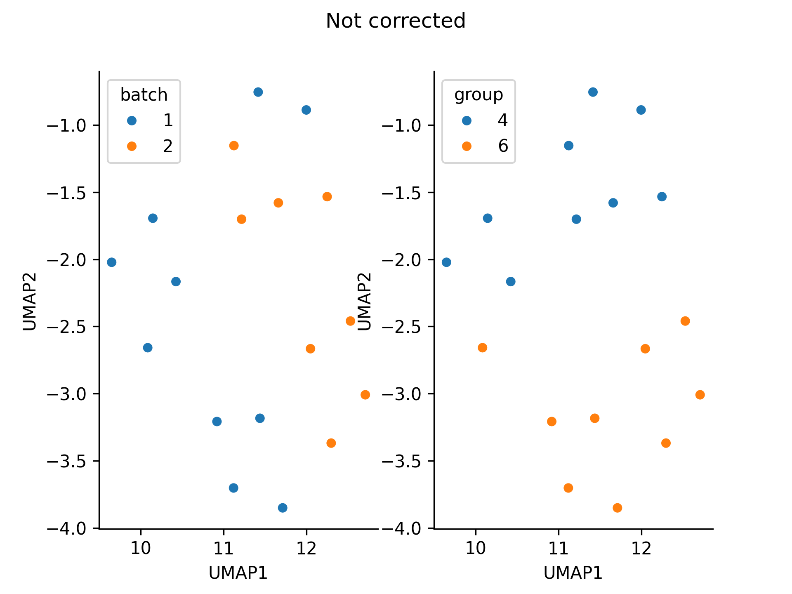
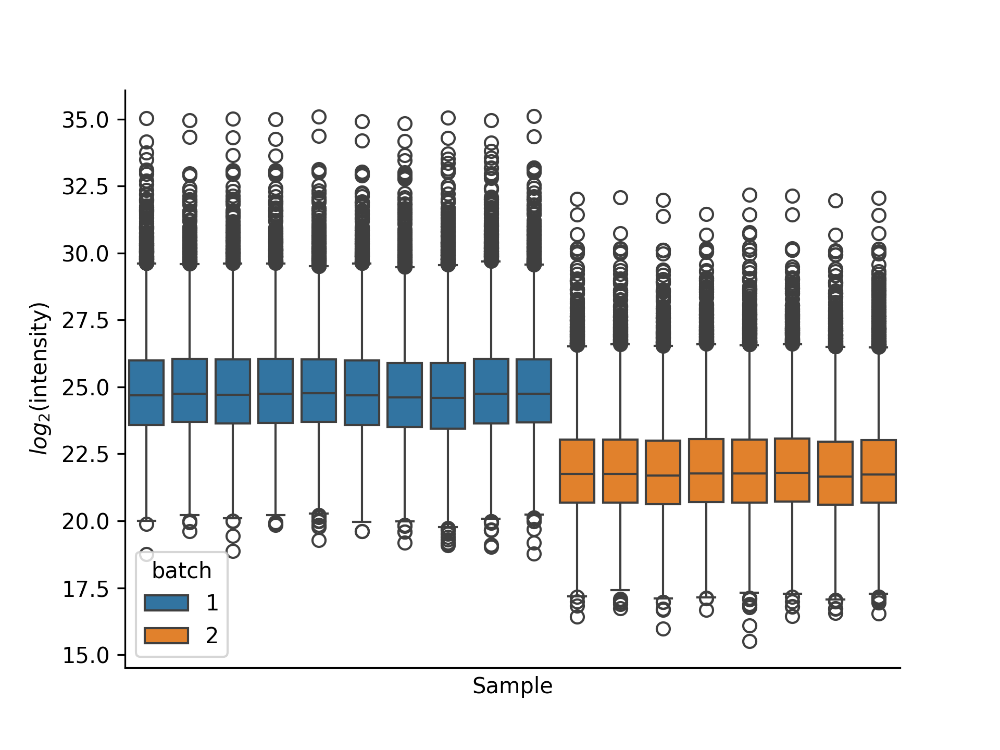
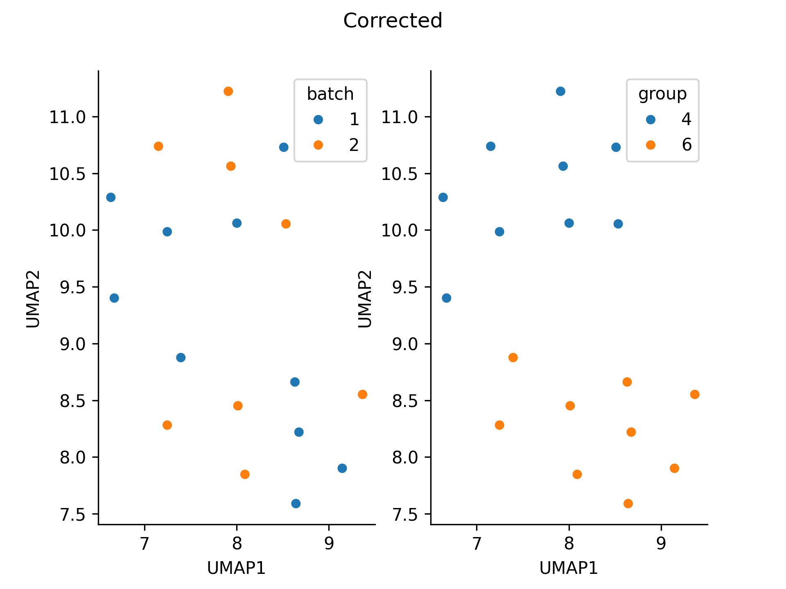
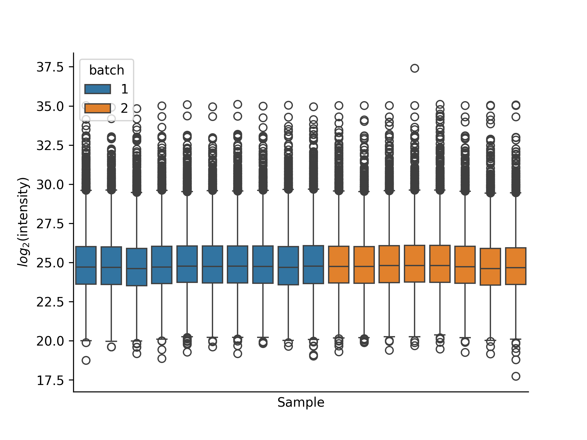

# Correction of batch effects


Normalization and correction is a crucial step in omics analysis to mitigate batch effects and technical variability between samples, ensuring that the observed signal reflects true biological variations rather than technical artifacts. DPKS currently offers two methods for handling batch effects:


* `combat` - The Combat method is a tool for batch correction, leveraging the ComBat algorithm [^1]. It models the sources of variation across batches and adjusts the data to harmonize feature distributions while preserving biological variability. 

* `mean` - The mean normalization method corrects for batch effects by adjusting the data based on the mean values and standard deviations within each batch. This approach assumes systematic differences in mean expression levels between batches and aims to align them, reducing batch-related variability.

!!! warning
    The combat method is heavily influenced by missing data. Be careful when applying it if your dataset contains missing values.

Batch correction can be performed as follows:

```python
from dpks.quant_matrix import QuantMatrix

qm = QuantMatrix(
    quantification_file="../tests/input_files/de_matrix.tsv",
    design_matrix_file="../tests/input_files/de_design_matrix.tsv"
).filter().normalize(method="log2").correct(method="mean", reference_batch=1)

```

## Example

```py
import pandas as pd

from dpks.quant_matrix import QuantMatrix

design_matrix_file = "../tests/input_files/de_design_matrix.tsv"

design_matrix = pd.read_csv(design_matrix_file, sep="\t")
design_matrix["batch"] = [1] * 10 + [2] * 8 # Dividing data into batches

import numpy as np

data_file = pd.read_csv("../tests/input_files/de_matrix.tsv", sep="\t")

for sample in design_matrix[design_matrix["batch"] == 1]["sample"]:
    data_file[sample] = data_file[sample] + np.random.normal(loc=5e6) # Adding synthetic batch effect
```
The data divides into batches.



Running batch correction removes the grouping on batch.
````
quant_matrix = QuantMatrix(
    quantification_file=data_file,
    design_matrix_file=design_matrix,
)

quantified_data = (
    quant_matrix.filter().impute(method="uniform_percentile").correct(method="mean", reference_batch=1)
)
````




[^1]: W. Evan Johnson, Cheng Li and Ariel Rabinovic. Adjusting batch effects in microarray expression data using empirical Bayes methods.
Biostatistics, 2007
<a href="https://doi.org/10.1093/biostatistics/kxj037" target="_blank">DOI: https://doi.org/10.1093/biostatistics/kxj037</a>