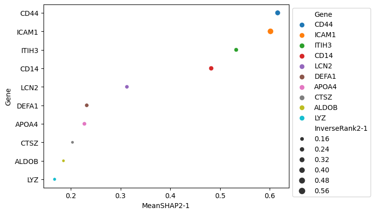
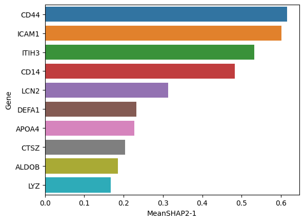

# Explainable Machine Learning

Sometimes when you are comparing experimental groups, it could be useful to identify only the most important proteins
associated with a particular proteome state. By selecting panels of proteins using machine learning, you can accelerate
the process of biomarker discovery, learn more about your dysregulated proteomes of interest, select important proteins
from the noise for further analysis. Sometimes, it is enough to select the most statistically significant differentially
abundant proteins, but many times these proteins may just be generic markers of inflammation in disease, but not specific
to a particular disease, or the most important in classifying between 2 proteome states.

Using DPKS, we can apply advanced explainable machine learning techniques using our bootstrapping approach combined with
[SHAP](https://shap.readthedocs.io/en/latest/) to calculate mean importances and mean ranks for proteins in an experiment
to help you decide which proteins to focus on for further analysis.

From a `QuantMatrix` object, it is trivial to apply these methods to your data:

```python
from dpks import QuantMatrix
from xgboost import XGBClassifier

clf = XGBClassifier(
    max_depth=2,
    reg_lambda=2,
    objective="binary:logistic",
    seed=42
)

qm = qm.explain(
    clf,
    comparisons=[(2, 1), (3, 1)],
    n_iterations=10,
    downsample_background=True
)
```

You just need to pass in a classifier of your choice, and indicate the comparisons you want to perform. It is possible to
perform multiple explanations, just like with differential abundance analysis.

The output columns will be named `MeanSHAP2-1` or `MeanSHAP3-1` and `MeanRank2-1` or `MeanRank3-1` depending on the number
of comparisons passed in to `explain()`.

!!! warning
    If you pass in a classifier other than `XGBCLassifier` or another tree based method, the SHAP value calulation will
    be extremely slow, so it is best to use `XGBClassifier` for now. We are working on adding fast support for linear
    methods without using SHAP.

From here, it is straightforward to visualize which proteins are most important for predicting a particular proteome state.




## Example

There is a jupyter notebook with some examples of how to use this functionality and some possible plots.

[Explainable Machine Learning](https://github.com/InfectionMedicineProteomics/DPKS/blob/main/notebooks/explain_api.ipynb): Demonstrates how to compute feature importance for proteins when predicting some experimental conditions.
